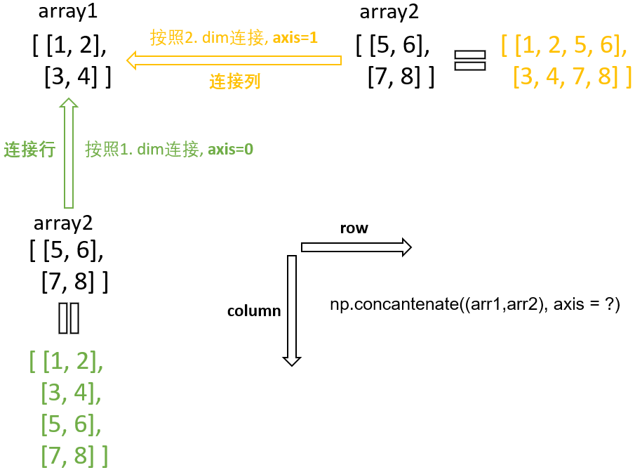

<sub>Title: Python 学习日记 - 科学计算基础NumPy 02<br>Author:<a href="https://github.com/Alpaka1017?tab=repositories" target="_blank">Xueyong Lu  <i class="fa fa-github" aria-hidden="true"></i></a></br><small>First Edition: March - 2023</small></sub>

<div align = "center">
    <h1>Python学习日记 - Day 03</h1>
</div>
<div align = "right">
    <h2><small>科学计算基础NumPy - Part2</small></h2>
</div>


📘<<[Day 02](./Python_Day02_Numpy_lib_Part1.md) | [Day 04](./Python_Day04_SerialPort.md)]>> 

[W3school帮助手册](https://www.w3school.com.cn/python/numpy_creating_arrays.asp)

## 1. 数组连接

### 1.1 数组连接操作

* NumPy提供了一个**`concatenate()`**函数用以连接数组。**`concatenate()`**函数允许用户以关键字**`axis`**来指定要连接数组的轴

* ℹ **注意**：**`axis`**缺省状态下，默认为**`axis = 0`**

  ```python
  arr1 = np.array([[1, 2], [3, 4]])
  arr2 = np.array([[5, 6], [7, 8]])
  # 两个2-D数组按照行（从左往右）的方式连接 -> 第2个维度
  arr_row = np.concatenate((arr1, arr2), axis=1) 
  
  # 两个2-D数组按照列（从上到下）的方式进行连接 ->第1个维度
  arr_col = np.concatenate((arr1, arr2), axis=0)
  
  print(arr_row)
  print(arr_col)
  
  >> [[1 2 5 6]
      [3 4 7 8]]
  >> [[1 2]
      [3 4]
      [5 6]
      [7 8]]
  ```

  

### 1.2 数组堆栈操作

* 堆栈与级联类似，不过堆栈是沿着新轴完成的

  ```python
  arr1 = np.array([1, 2, 3])
  arr2 = np.array([4, 5, 6])
  
  arr = np.concatenate((arr1, arr2), axis=0)     # 要连接的是两个1dim数组，所以axis=1会引起错误
  arr_stack_row = np.stack((arr1, arr2), axis=0) # 1st dim：按行方向连接，连接的是列
  arr_stack_col = np.stack((arr1, arr2), axis=1) # 2nd dim：按列方向连接，连接的是行
  
  print(arr)
  print(arr_stack_row)
  print(arr_stack_col)
  
  >> [1 2 3 4 5 6] # 一维数组连接只能得到一维数组
  >> [[1 2 3]		 # 一维数组按列的方向堆栈，axis = 0
      [4 5 6]]
  >> [[1 4]		 # 一维数组按行的方向堆栈，axis = 1
      [2 5]
      [3 6]]
  ```

  ℹ**注意**：**`np.stack(var1, var2)`**函数能接收两个args，**var1**为要连接的数组，以**Tuple (arr1, arr2, ...)**的形式，**var2**参数为连接的轴

* 除了在**`np.stack()`**中指定关键字`axis`，也可以用NumPy提供的三个辅助函数进行不同维度的堆栈：

  * **`hstack()`按行堆栈**

    ```python
    arr1 = np.array([1, 2, 3])
    arr2 = np.array([4, 5, 6])
    
    arr = np.concatenate((arr1, arr2), axis=0)
    arr_hstack = np.hstack((arr1, arr2))
    
    print(arr)
    print(arr_hstack)
    
    >> [1 2 3 4 5 6]
    >> [1 2 3 4 5 6]
    ```

  * **`vstack()`按列堆栈**

    ```python
    arr1 = np.array([1, 2, 3])
    arr2 = np.array([4, 5, 6])
    
    arr_stack_row = np.stack((arr1, arr2), axis=0)  # 1st dim：按行连接，连接的是列
    arr_vstack = np.vstack((arr1, arr2))
    
    print(arr_stack_row)
    print(arr_vstack)
    
    >> [[1 2 3]
        [4 5 6]]
    >> [[1 2 3]
        [4 5 6]]
    ```

  * **`dstack()`按高度/深度堆栈**

    ```python
    arr1 = np.array([1, 2, 3])
    arr2 = np.array([4, 5, 6])
        
    arr_stack_col = np.stack((arr1, arr2), axis=1)  # 2nd dim：按列连接，连接的是行
    arr_dstack = np.dstack((arr1, arr2))
        
    print(arr_stack_col)
    print(arr_dstack)
    
    >> [[1 4]
        [2 5]
        [3 6]]
    >> [[[1 4]
         [2 5]
         [3 6]]]
    ```

    |                           | **`np.hstack()`** | **`np.vstack()`** | **`np.dstack()`** |
    | ------------------------- | :---------------: | :---------------: | :---------------: |
    | **方向**                  |       按行        |       按列        |         -         |
    | **`axis`**                |      0/ 1st       |   0/ 1st. dim.    |         -         |
    | **维度**                  |         1         |         2         |       **3**       |
    | **改变的维度**            |        列         |        行         |         -         |
    | **与`concatenate()`函数** |       相同        |       相同        |         -         |

## 2. 数组拆分

* 数组拆分是数组连接的反向操作，在NumPy中提供了**`array_split()`**函数用以实现此功能，**`array_split(arr, num)`**函数有两个参数，分别为要分割的数组和要分割成子数组的个数。

* **拆分一维数组**

  ```python
  arr = np.array([1, 2, 3, 4, 5, 6])
  newarr = np.array_split(arr, 4)
  for sub_arr in newarr:
      arr_list.append(sub_arr)
      arr_bool_list.append(type(sub_arr) == np.ndarray)
  
  print(newarr)
  print(newarr[1])
  print(arr_list[1])
  print(arr_bool_list[1])
  
  print(arr_list[1][1]) # 对列表元素的子元素索引，子元素为二维数组时：arr_list[1][1, 2]
  
  >> [array([1, 2]), array([3, 4]), array([5]), array([6])] # 从末尾自动调整子数组的大小
  >> [3 4]
  >> [3 4]
  >> True # 拆分后的每一个子数组都为np.ndarray类型
  >> 4
  ```

  ℹ**注意**：

  * **`array_split`**函数返回一个由子数组构成的列表
  * 如果要拆分的子数组个数与原来数组的元素个数比匹配，则会从末尾进行相应的调整

* **拆分二维数组**

  ```python
  arr = np.array([[1, 2], [3, 4], [5, 6], [7, 8], [9, 10], [11, 12]])
  
  newarr = np.array_split(arr, 3) # 将2-D arr数组拆分为三个2-D数组
  for subarr in newarr:
      print(f'Subarray:/n {subarr}')
  
  print(newarr)
  
  >> Subarray:
  		    [[1 2]
   		     [3 4]]
     Subarray:
  		    [[5 6]
  		     [7 8]]
     Subarray:
   		    [[ 9 10]
   		    [11 12]]
  >> [array([[1, 2],
             [3, 4]]),
      array([[5, 6],
        	   [7, 8]]), 
      array([[ 9, 10],
             [11, 12]]) ]
  ```

* **指定拆分轴**

  ```python
  arr = np.array([[1, 2, 3], [4, 5, 6], [7, 8, 9], [10, 11, 12], [13, 14, 15], [16, 17, 18]])
  
  newarr_row = np.array_split(arr, 3, axis=0)  # 二维数组沿1st dim.拆分（按行）
  newarr_col = np.array_split(arr, 3, axis=1)  # 二维数组沿2nd dim.拆分（按列）
  newarr_hsplit = np.hsplit(arr, 3)
  newarr_vsplit = np.vsplit(arr, 3)
  # newarr_dsplit = np.dsplit(arr, 3)
  
  print(newarr_row) # 1st dim.，按行拆分 = vsplit()
  print(newarr_vsplit)
  print(newarr_col) # 2nd dim., 按列拆分 = hsplit()
  print(newarr_hsplit)
  ```

  ℹ**注意** ：

  * 在拆分操作中，NumPy也提供了类似于数组堆栈中的**`hstack(), vstack(), dstack()`**函数
  * 使用**`dsplit()`**要求待分割的数组为3维

## 3. 数组搜索

### 3.1 搜索数组

* NumPy提供了一个搜索并匹配数组中符合搜索条件的函数**`np.where()`**方法，该方法返回的是一个由满足匹配元素索引的元组

  ```python
  arr = np.array([1, 2, 3, 4, 5, 4, 4])
  
  arr_search = np.where(arr == 4)
  
  # arr_search为元组对象，arr_search[0]为返回的索引列表（类型为np.ndarray），arr_search[0][2]可以访问第3个索引对象
  print(f'返回索引：{arr_search}/n数据类型为：{type(arr_search)}/n索引数组{arr_search[0]}的类型为：{type(arr_search[0])}/n其中第3个满足搜索的索引值为：{arr_search[0][2]}')
  
  >> 返回索引：(array([3, 5, 6], dtype=int64),)
  >> 数据类型为：<class 'tuple'>
  >> 索引数组[3 5 6]的类型为：<class 'numpy.ndarray'>
  >> 其中第3个满足搜索的索引值为：6
  ```

### 3.2 搜索排序

* NumPy提供了一个**`searchsorted(arr, Var, ...)`**的方法，作用是返回一个索引值，在此位置<u>插入</u>**<u>Var</u>**能够维持搜索顺序

  ```python
  arr = np.array([6, 7, 8, 9])
  idx_left = np.searchsorted(arr, 7.5)
  idx_right = np.searchsorted(arr, 7.5, side='right')
  
  print(idx_left)
  print(idx_right)
  
  >> 2
  >> 2 # 从右往左，第索引3处插入"7.5"，以使该值不再小于下一个值
  ```

  ℹ**注意**：

  * **`searchsorted()`**在**左$/rightarrow$右**时返回==第一个大于或等于==要查找的值的元素的索引，**左$/leftarrow$右**时返回==第一个小于或等于==要查找的值的元素的索引
  * **`searchsorted()`**函数在使用时默认数组是按照==升序==排序的，否则会造成不准确

* **搜索多个值**

  ```python
  arr = np.array([1, 3, 5, 7])
  x = np.searchsorted(arr, [2, 4, 6])
  
  print(x)
  >> [1 2 3]
  ## 返回[2, 4, 6]分别要插入的位置，从左到右升序排列
  ```


## 4. 数组排序

NumPy的`ndarray`对象提供了一个**`sort()`**的函数，能够对`ndarray`对象的任意类型元素进行排序，包括升序和降序。

* **数值类型**

  ```python
  arr = np.array([3, 2, 0, 1])
  
  print(np.sort(arr))
  
  >> [0 1 2 3]
  ```

* **字符类型**

  ```python
  arr = np.array(['banana', 'cherry', 'apple'])
  
  print(np.sort(arr))
  
  >> ['apple' 'banana' 'cherry']
  ```

* **布尔类型** (0 $/rightarrow$ 1)

* **2-D数组**

  ```python
  arr = np.array([[3, 2, 1], [6, 5, 4], [9, 8, 7]])
  
  print(np.sort(arr))
  
  >> [[1, 2, 3],
      [4, 5, 6],
      [7, 8, 9]]
  ```

  ℹ**注意：**`np.sort()`函数对二维数组的排序原则：

  * 默认情况下按照`axis=1`（列）进行排序，即不改变向量的顺序，而是对每个向量的元素进行升序排序
  * 可以通过指定要排序的轴`axis=0`进行排序，即对按照每个向量的首元素对向量进行排序，如下所示：

  ```python
  arr = np.array([[3, 2, 1], [9, 8, 7], [6, 5, 4]])
  print(np.sort(arr, axis=0))
  
  >> [[3, 2, 1],
      [6, 5, 4],
      [9, 8, 7]]
  ```

* **通过关键字实现任意排序规则**

  ```python
  a = np.array(['apple', 'banana', 'cherry'])
  a.sort(key=lambda x: len(x))
  
  print(a)
  
  >> ['apple' 'cherry' 'banana']
  ```

  * 本例中通过一个`lamda`函数来指定排序的关键字key，实现按照元素的长度进行排序

## 5. 数组过滤

* 从现有数组中**<u>取出一些元素</u>**并从中**<u>创建新数组</u>**称为过滤（filtering）。

  在 NumPy 中，我们使用**<u>布尔索引列表</u>**来过滤数组。

  布尔索引列表是<u>**与数组中的索引相对应的布尔值**</u>列表。

  如果索引处的值为 `True`，则该元素包含在过滤后的数组中；如果索引处的值为 `False`，则该元素将从过滤后的数组中排除。

### 5.1 创建过滤器

* 创建一个元素>=60的过滤器：

  ```python
  def np_array_filter(ndArray_filter):
      # 作用，对数组中的元素进行遍历，值>60的返回True，否则则返回False
      filter_list = []
      ndArray_float = ndArray_filter.astype('float')
      for element in ndArray_float:
          if element >= 60:
              filter_list.append(True) # 注意这里的过滤器列表里是布尔值，而非字符串'True'
          else:
              filter_list.append(False)
      return filter_list
  
  arr = np.array([1, 5, 3, 87, 687, 2, 4, '4', '456', 6, '64'])
  newarr = arr[np_array_filter(arr)]
  print(newarr)
  
  >> ['87' '687' '456' '64']
  ```

### 5.2 直接从数组创建过滤器

* 要求`np.array`对象的元素都是与过滤器可运算的**>=**

  ```python
  arr = np.array([45, 94, 87, 687, 75, 45, 60])
  filter_arr = arr >= 60
  # filter_arr = arr % 2 == 0  # 返回偶数的过滤器
  newarr = arr[filter_arr]
  
  print(newarr)
  
  >> [ 94  87 687  75 60]
  ```

## 6. 随机模块`random`

* NumPy提供了一个处理随机数的模块**`random`**

* 要使用随机数模块，需要先从NumPy引入：

  ```python
  from numpy import random
  ```

### 6.1 随机数

* ```python
  x = random.randint(100) # 0~100之间的随机整数
  ```

* ```python
  y = random.rand()       # 0~1  之间的随机浮点数
  ```

### 6.2 随机数组

* **整数**：`random.randint()` 方法接受 `size` 参数，可以在其中指定数组的形状

  ```python
  x = random.randint(100, size = (5))    # 1-D随机数组，包含5个0~100的整数
  ```

  ```python
  x = random.randint(100, size = (3, 5)) # 2-D随机数组，3行，每行有5个0~100的随机数
  ```

* **浮点数**：`random.rand()`

  ```python
  x = random.rand(5)                     # 1-D随机数组，5个0~1之间的浮点数
  ```

  ```python
  x = random.rand(3,5)                   # 2-D随机数组，3行，每行有5个0~1的随机数
  ```

* **[-1, 1]之间的浮点数**

  ```python
  arr = random.uniform(low=-1, high=1, size=(5,5))
  ```

### 6.3 从数组随机选取

* **`choice()`方法**

  ```python
  x = random.choice([3, 5, 7, 9])
  ```

* **指定形状的数组choice()**

  ```python
  x = random.choice([3, 5, 7, 9], size=(3, 5))
  ```

  ℹ**注意**：指定了形状之后，元素可重复出现

## 7. ufuncs

### 7.1 介绍

* ufuncs 指的是“通用函数”（Universal Functions），它们是对 **ndarray** 对象进行操作的 **NumPy 函数**

* ufunc 用于在 NumPy 中实现==向量化==

* 将迭代语句转换为==基于向量的操作==称为向量化

  * 例如：两个数组相加

    ```python
    x = [1, 2, 3, 4]
    y = [4, 5, 6, 7]
    z = []
    
    for i, j in zip(x, y):
      z.append(i + j)
    ```

  * **ufunc的add()方法**

    ```python
    x = [1, 2, 3, 4]
    y = [4, 5, 6, 7]
    z = np.add(x, y)
    ```

### 7.2 常用的`ufunc`函数

| **算数运算** | **`add()`、`subtract()`、`multiply()`、`divide()`、`floor_divide()`、`mod()`、`power()`** |
| ------------ | ------------------------------------------------------------ |
| **绝对值**   | **`absolute()`、`fabs()`**                                   |
| **三角函数** | **`sin()`、`cos()`、`tan()`、`arcsin()`、`arccos()`、`arctan()`** |
| **指数函数** | **`exp()`、`exp2()`、`log()`、`log2()`、`log10()`**          |
| **取整函数** | **`ceil()`、`floor()`、`trunc()`**                           |
| **比较函数** | **`greater()`、`greater_equal()`、`less()`、`less_equal()`、`equal()`、`not_equal()`** |
| **统计函数** | **`sum()`、`mean()`、`std()`、`var()`、`max()`、`min()`、`argmax()`、`argmin()`** |


📘<<[Day 02](./Python_Day02_Numpy_lib_Part1.md) | [Day 04](./Python_Day04_SerialPort.md)]>> 
