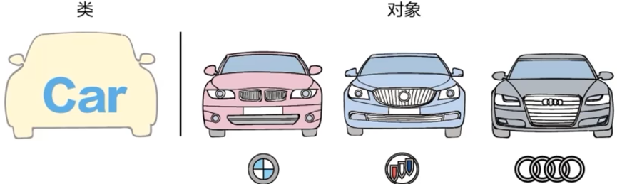

<sub>Title: Python 学习日记 - 对象和类<br>Author:<a href="https://github.com/Alpaka1017?tab=repositories" target="_blank">Xueyong Lu  <i class="fa fa-github" aria-hidden="true"></i></a></br><small>First Edition: March - 2023</small></sub>

<div align = "center">
    <h1>
        Python 学习日记 - Part 06
    </h1>
</div>
<div align = "right">
    <h2>对象和类</h2>
</div>


📘<<[Part 05](./Python_Part_05-SerialPort.md) | [Part 07](./Python_Part_07-Plot.md)]>> 

## 1. 面向对象

面向对象：按照真实世界的思维方式进行软件系统的构建。



### 1.1 定义类

```python
# class <类名>(<父类>)
# 		类体

class Car(object):
	pass

class Car:
    pass
```

* 如果在类的定义中**`<父类>`**缺省，那么将会继承一个**`object`**类。
* 在Python中，**`object`**类是所有类的**根类**，其他所有的类都直接或者间接继承`object`类

### 1.2 创建对象

* 实例化类的过程就是创建对象的过程

* 对象可以看做一群具有类的特征的元素的集合

  ```python
  class Car:
      pass
  
  # 创建对象
  car = Car()
  print(type(car))
  
  >> <class '__main__.Car'>
  ```

### 1.3 类的成员

 

#### 1.3.1 实例变量

* 实例变量是对象个体特有的属性或者数据。

* 通过类的构造函数**`__init__(self, var1, var2, ...)`**进行新对象的构造和初始化

  ```python
  new* # 定义新类，对象时，会自动生成一个new*的非注释类的关键字
  class People(object):
      def __init__(self, name, age):
          self.name = name  # 创建和初始化实例变量name
          self.age = age    # 创建和初始化实例变量age
          return
  
  if __name__ == "__main__":
      # 用类的方法来构造对象
      person = People('XiaoZhao', 24)
      print('{}巨能睡, 虽然才{}岁，但是跟{}岁似的。'.format(person.name, person.age, 3*person.age))
  ```

* **`person`** 是对象，通过类**`People():`**构造

* **`name`**和**`age`**都是对象**`person`**的实例化对象，通过**``object.memberVar``**的方式对其访问

#### 1.3.2 构造方法

* **`__init__`**方法时一个非常特殊的方法，也称**构造方法**

* 作用是创建和初始化实例变量

* **`__init__`**方法本身没有开辟新的内存空间

  ```python
  class People(object):
      def __init__(self, name, age, gender='妹妹'):
          self.name = name  # 创建和初始化实例变量name
          self.age = age  # 创建和初始化实例变量age
          self.gender = gender
          return
  
  
  if __name__ == "__main__":
      # 用类的方法来构造对象
      person_1 = People('XiaoZhao', 24)
      person_2 = People('XiaoLu', 25, '老哥')
      person_3 = People(name='Anyone', gender='爱啥啥', age='爱几岁几岁')
      print('{}巨能睡, 虽然才{}岁，是{}的好{}。'.format(person_1.name, person_1.age, person_2.name, person_1.gender))
      print('{}是她的大{}，他都{}岁了。'.format(person_2.name, person_2.gender, person_2.age))
      print('{}只是个凑数的例子，他{}，性别{}。'.format(person_3.name, person_3.age, person_3.gender))
      
  >> XiaoZhao巨能睡, 虽然才24岁，是XiaoLu的好妹妹。
  >> XiaoLu是她的大老哥，他都25岁了。
  >> Anyone只是个凑数的例子，他爱几岁几岁，性别爱啥啥。
  ```

  ℹ**注意：**

  * 用类构造新对象时，对象的实例化参数为定义的参数，而与类中初始化的参数无关
  * 定义对象的参数与传入类的参数一一对应，而与顺序无关
  * 默认在类中指定的参数要放在最后**`gender='xxx'`**

#### 1.3.3 实例方法

* 实例方法与构造方法的变量一样，都是某个实例（对象）个体特有的方法

* 注意两种方法：

  * 实例方法中调用类中定义的变量**`self.var`**，这里实例方法的调用就不需要外部参数，可以是**`Func(self)`**
  * 实例方法也可以通过外部传入参数，此时函数定义为**`Func(self, var)`**

  ```python
  class People(object):
      # 构造方法
      def __init__(self, name, age, hobby, gender='妹妹'):
          '''
          '''
          self.hobby = hobby
          return
      # 实例方法
      def interest_Inst_var(self):  # 使用类的参数
          print('{}的爱好是{}。'.format(self.name, self.hobby))
  
      def interest_Passed_parm(self, hobby):  # 使用外部传入参数
          print('{}的爱好是{}。'.format(self.name, hobby))
  if __name__ == "__main__":
      person_1 = People(name='XiaoZhao', age=24, hobby='跳舞')
      person_2 = People(name='XiaoLu', age=25, gender='老哥', hobby=None)
      
      person_1.interest_Inst_var()  # 调用类中声明的变量self.xxx
      person_2.interest_Passed_parm('Guitar')  # 从外部传入参数
      
  >> XiaoZhao的爱好是跳舞。
  >> XiaoLu的爱好是Guitar。
  ```

#### 1.3.4 类变量

* 类变量属于类，而不属于某个对象

* 类中的方法（构造方法或者实例方法）要调用类变量时，要通过类变量的父级（类名）来调用

  ```python
  *new
  class Example(object):
      # Define class variable
      var_class = 1000
      
      # Define initializing method
      def __init__(self, var1, var2):
          self.var1 = var1
          self.var2 = var2
          return
      
      # Define Instantiating method
      def Instantiating_method(self, var3):
          return self.var1 + var3
      
  # Call the class variable using a instantiated method:
  if __name__ == '__main__':
      example_obj = Example(var1_real, var2_real)
      example_obj.Instantiating_method(Example.var_class)
      # var1 was defined and initialized in __init__ method
  ```

#### 1.3.5 类方法

* 与类变量一样，类方法也属于类，而不属于某个对象实例

* 声明类方法的方式为装饰器**`@`**，装饰器在后面学习中会继续讨论

* 类方法可以调用类变量（构造/实例方法不行），eg: **`cls.class_var`**

* 但是在**类方法**中无法调用其他的实例变量，eg: **`self.var1`**

  ````python
  class Example_calculation(object):
      # Define class variable
      class_var = 100
  
      # Initializing method
      def __init__(self, var1, var2):
          self.var1 = var1
          self.var2 = var2
          return
  
      # Define instantiating method
      def add_calculation(self, var):
          return self.var1 + Example_calculation.class_var + var
  
      # Define class method
      @classmethod
      def class_method_examp(cls, num):  # 类方法不能调用实例变量（self.var1）
          return cls.class_var + num
      
  cal_examp = Example_calculation(var1=1, var2=2)
  print(cal_examp.add_calculation(1))
  print(cal_examp.class_method_examp(1))
  
  >> 102
  >> 101
  ````

#### 1.3.6 私有变量和私有方法

* 私有变量和私有方法都是只有在类里面才能访问的变量和方法

* 在类的外面如**`main()`**函数访问一个类的私有变量或者方法，会抛出**`AttributeError`**

* 私有变量的<u>构造</u>**`__init__`**方法：**`self.__var = var`**

* 私有方法的构造：**`def __func(self):`**

  ```python
  *new
  class Examp_private(object):
      # Define class private varible
      __Class_var = 1000
      
      # Initializing variable
      def __init__(self, var1, var2)
      	self.__var1 = var1    # var1 is a class-private variable
          self.var2 = var2
          return
      
      # Define private instantiating method
      def __private_examp(self):  # private method: only callable inside the class "Examp_private"
          return (self.var2 + Examp_private.__Class_var) * self.__var1
      
      def desc(self):
          return self.__private_examp()
      
  examp = Examp_private(var1 = 1, var2 = 2)
  print(examp.__private_examp())  # AttributeError
  print(examp.desc())
  ```

  * 上述调用中：`print(examp.__private_examp())`会抛出一个**`AttributeError`**的错误，因为**`__private_examp()`**为类内部的方法
  * **`print(examp.desc())`**方法能够正常输出，因为`desc()`方法为公共方法，同时`desc()`调用了一个类的内部方法

#### 1.3.7 使用属性

* 为了实现对象的封装，在一个类中==不应该==有公有的成员变量，这些成员变量应该被设计为私有的，然后通过公有的**set**和**get**方法访问。

  ```python
  *new
  class Example_get_set(object):
      # Construction initializing method
      def __init__(self, var1, var2):
          self.var1 = var1
          self.__var2 = var2
          return
      
      # Define `get` method
      def get_Private_var(self):
          return self.__var2
      
      # Define `set` method
      def set_Private_var(self, var_extern):
          self.__var2 = var_extern
          
  # call the methods
  examp = Example_get_set(var1=1, var=2)
  print(examp.get_Private_var()) # Print the private variable inside the class
  examp.set_Private_var(new_var) # Set new variable to the private variable
  print(examp.get_Private_var()) # Print the private variable after modification
  ```

  * 能够在外部通过调用`get_var2`方法获取class `Example_get_set`的内部变量`__var2`
  * 通过调用`set_var2`方法从外部更改class `Example_get_set`的内部变量`__var2`

* 可以通过**属性**来替代`get`和`set`方法

  ```python
  *new
  class Example_property(object):
      # Initializing: var2 is the private variable
      def __init__(self, var1, var2):
          self.var1 = var1
          self.__var2 = var2
          return
      
      @property
      def var2(self):            # Substitute `get_Private_var()` method
          return self.__var2
      
      @var2.setter
      def var2(self, var2):      # Substitute `set_Private_var()` method
      	self.__var2 = var2
          
  # Call the methods
  examp = Example_property(var1=1, var2=2)
  print(examp.var2)              # Through a decorator with the same name of var2, enable the directl call
  examp.var2 = new_var
  print(examp.var2)			   # Through `@var2.setter` enable the direct modification of a private variable from outside
  ```

  * 装饰器**`@property`**下定义的方法名就是类里的私有变量名，这样即使在外部也能直接通过访问变量本身来调用变量
  * 装饰器**`var2.setter`**定义的方法名也为类里的私有变量名，但是**`.setter`**提供了能直接赋值的方法
  * 装饰器**`@property`**将一个方法转换为只读属性，可以通过直接调用方法的方式获取属性值
  * **`@var2.setter`** 装饰器则是用来定义一个与 **`@property` **装饰器配合使用的方法，用来设置属性的值。这样，类的属性就可以通过类的实例直接进行读写操作，而不需要通过调用方法来实现
  * 通过 **`@property`** 和**`@var2.setter`** 装饰器的组合使用，就可以实现对类属性的封装，同时保证类属性的安全性，让类的使用更加方便和安全。
    * 装饰器`@`后面的内容是一个函数或方法，用来装饰被修饰的函数或方法
    * 装饰器本质上是一个Python函数或类，可以通过在函数或类上添加装饰器来扩展或修改函数或类的行为
    * 当Python解释器遇到一个被装饰的函数或方法时，会自动把它作为参数传递给装饰器，然后将装饰器的返回值作为新的函数或方法返回给调用者。这样就可以在不修改原有函数或方法代码的情况下，增加或修改其功能

### 1.4 类和对象的性质

#### 1.4.1 封装性

* 封装性是指，将数据和方法包装在类的内部，通过==访问控制==实现对外部的隐藏。这种隐藏机制可以避免外部直接访问和修改类内部的变量和方法，保证了程序的安全性和可维护性

* 具体来说，``Python`中通过将变量和方法定义为公有`（public）``、``私有（private）``和``受保护（protected）``三种访问权限，实现对类和对象的封装

  * **公有变量**和方法可以在类的<u>内部</u>和<u>外部</u>访问
  * **私有变量**和方法<u>只能在类的内部</u>访问
  * **受保护变量**和方法可以在<u>类的内部</u>和<u>子类</u>中访问

* 通过封装性，可以隐藏类的内部实现细节，只暴露必要的接口给外部使用，从而提高代码的可维护性和可扩展性。同时，封装也可以保护数据的完整性，防止外部误操作导致的错误和安全问题

  
  
  |      类型      |          构造方法          | 内部调用 | 子类调用 | 对象调用 | 外部调用 |
  | :------------: | :------------------------: | :------: | :------: | :------: | :------: |
  |  **公有变量**  | **`self.variable_namer`**  | &#x2705; | &#x2705; | &#x2705; | &#x2705; |
  | **受保护变量** | **`self._variable_name`**  | &#x2705; | &#x2705; | &#x274C; | &#x274C; |
  |  **私有变量**  | **`self.__variable_name`** | &#x2705; | &#x274C; | &#x274C; | &#x274C; |
  |   **类变量**   |    **`variable_name`**     | &#x2705; | &#x2705; | &#x2705; | &#x2705; |
  | **类私有变量** |   **`___variable_name`**   | &#x2705; | &#x2705; | &#x274C; | &#x274C; |
  
  ℹ**注意：**&#x274C;表示不能通过此方法直接调用，但是仍然能够通过**`getter`**、**`setter`**的方法，或者通过装饰器**`@property`**来从外部访问受保护的变量。

#### 1.4.2 继承性

* 继承性是面向对象编程的一个重要的概念和性质 

* 通过继承，一个类可以获得另一个类的属性和方法，同时还可以添加自己的属性和方法

* **基类、父类或超类** → **子类或派生类**：
  
  * 子类可以==调用==父类中的方法和属性，而无需重新定义 →  **`super()函数`**
  * 同时子类还能根据自己的定义==添加==新的属性和方法 → **方法重写**
  * ==覆盖==从父类继承的属性和方法
  
* 方法：通过在定义子类时指定其父类来实现

* 特点：
  * 可以实现代码重用，减少重复编写代码的工作量，同时也可以提高代码的可读性和可维护性
  * 继承还可以将相似的类组织在一起，形成更清晰的类层次结构
  
  ```python
  import math
  
  *new
  class Example_parent(object):
      # 初始化类变量
      def __init__(self, var1, var2):
          self.var1 = var1
          self._var2 = var2  # 为使子类能够调用，不能构造为私有变量，而是受保护的变量`_var`
          return
  
      @property
      def var2(self):
          return self._var2
  
      def log_parent_func(self, var):
          return math.log((self._var2 + self.var1), var)
  
  
  class Example_child(Example_parent):  # 见上，如果不加括号，则默认继承python的类“object”
      # 子类中定义有三个变量，其中var1, _var2是通过父类super()函数传入的，所以还需再构造一个var3
      def __init__(self, var3, **kwargs):
          # var2为父类中的受保护变量，在这里直接通过变量名var2调用即可，不用_var2
          super().__init__(**kwargs)
          self.var3 = var3
  
      def exp_child_func(self, var4):
          # 在子类的实例方法中，由于var2是由父类传递的，所以要声明“受保护变量”
          return ((self.var1 + self._var2) / self.var3) * math.exp(var4)
  
      
  parent = Example_parent(var1=5, var2=6)
  log_parent_base = 7
  print('父类中传入的参数为:{}和{}, 父类中对数运算的底为:{}, 对数计算的结果为:/n{}'.format(parent.var1, parent.var2,                     log_parent_base, parent.log_parent_func(log_parent_base)))
  child = Example_child(var1=parent.var1, var2=parent.var1, var3=3)
  exp_child_exponent = 2
  print(f'子类中传入的参数为:{child.var3}, 子类的运算函数传入指数为:{exp_child_exponent}, 并且继承了父类中的两个参数{parent.var1}和       {parent.var2}, 指数计算的结果是:/n{child.exp_child_func(exp_child_exponent)}')
     
  >> 父类中传入的参数为:5和6, 父类中对数运算的底为:7, 对数计算的结果为:
  >> 1.2322744058673438
  >> 子类中传入的参数为:3, 子类的运算函数传入指数为:2, 并且继承了父类中的两个参数5和6, 指数计算的结果是:
  >> 24.6301869964355
  >> print(child.log_parent_func(6)) --> 2.6233880420442417
  >> print(parent.log_parent_func(6))--> 2.570194417876938
  # 从子类中调用父类的log_parent_func()实例方法时，为什么总是会有一点偏差？
  ```
  
  ##### 1.4.2.1 多继承
  
  * 在 Python 中，一个子类可以从多个父类继承属性和方法。将多个不同的父类的特性组合成一个子类，实现多种功能
  
  * MRO（Method Resolution Order）确定了类实例在调用方法时的顺序，它是一种线性顺序，用于解决当多个父类中有同名方法时的调用顺序
  
    ```python
    class Parent1:
        def __init__(self, var1):
            self.var1 = var1
    
    class Parent2:
        def __init__(self, var2):
            self.var2 = var2
    
    class Child(Parent1, Parent2):
        def __init__(self, var1, var2, var3):
            # Parent1 和 Parent2 相互独立，需手动调用每个父类的构造函数来初始化它们的实例变量
            # 在 Child 中没有直接调用 Parent1 和 Parent2 的 __init__() 函数，所以不能使用 super() 函数
            Parent1.__init__(self, var1)
            Parent2.__init__(self, var2)
            self.var3 = var3
    
    child = Child(1, 2, 3)
    print(child.var1, child.var2, child.var3)  # 输出1 2 3
    ```
  
  ##### 1.4.2.2  方法重写
  
  * 指在子类中定义与父类中同名的方法，以覆盖父类的方法
  
  * 子类重写父类的方法时，必须保持方法名、参数列表和返回值类型相同，在子类实例调用该方法时：**子类 > 父类**
  
  * 覆盖：
  
    ```python
    class Parent:
        def func(self):
            print("This is Parent's func")
    
    class Child(Parent):
        def func(self):
            print("This is Child's func")
    
    parent = Parent()
    child = Child()
    
    parent.func()  # This is Parent's func
    child.func()   # This is Child's func
    ```
  
  * 扩展：
  
    ```python
    class Example_Parent_override:
        def say_hello(self):
            print("Hello from Parent")
    
    class Example_Child_override(Example_Parent_override):
        def say_hello(self):
            super().say_hello()   # 调用父类的方法
            print("Hello from Child")
    
    greeting = Example_Child_override()  # 子类声明
    greeting.say_hello()
    
    >> Hello from Parent
    >> Hello from Child
    ```

#### 1.4.3 多态性

* 在面向对象编程中，多态性是指==同一个方法名==可以被==不同的对象==所调用，而产生==不同的结果==

* ℹ：在 Python 中，多态性是通过继承和方法重写实现的 

* 当子类重写了父类中的方法，而调用该方法的对象是子类的实例时，就会使用子类中重写的方法，而不是父类中的方法

  ```python
  class Animal:
      def make_sound(self):
          pass
  
  class Dog(Animal):
      def make_sound(self):
          print("Woof!")
  
  class Cat(Animal):
      def make_sound(self):
          print("Meow!")
  
  class Bird(Animal):
      def make_sound(self):
          print("Tweet!")
  
  def make_animal_sound(animal):
      animal.make_sound()
  
  dog = Dog()
  cat = Cat()
  bird = Bird()
  
  make_animal_sound(dog)   # 输出：Woof!
  make_animal_sound(cat)   # 输出：Meow!
  make_animal_sound(bird)  # 输出：Tweet!
  ```

  * 在这个示例中，Animal 是父类，而 Dog、Cat、Bird 是子类。它们都有一个 `make_sound() `方法，但是实现不同。``make_animal_sound() `函数接受一个 Animal 类型的参数，根据传入的对象类型自动选择对应的实现，从而实现多态性。
  * 实例化子类对象，并作为一个函数传入的参数，函数（父类中定义）在接收这个（相同）的参数后，会逐步从子类中寻找正确的子类实例，并做出响应


📘<<[Part 05](./Python_Part_05-SerialPort.md) | [Part 07](./Python_Part_07-Plot.md)]>> 

